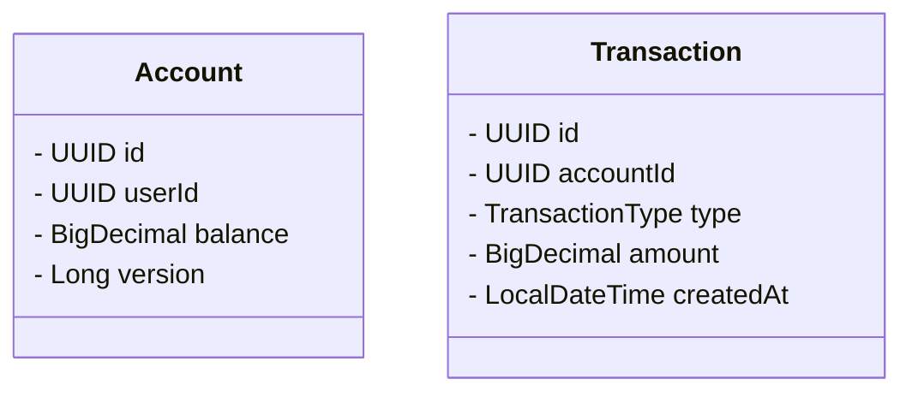

# Система управления счетами пользователей

## 1. Назначение системы
Система предназначена для управления финансовыми счетами пользователей в интернет-магазинах. Она позволяет:
- Создавать счета для новых пользователей
- Пополнять баланс счетов
- Обрабатывать списания средств
- Просматривать историю операций
- Контролировать финансовые потоки

## 2. Функциональные требования
1. Создание нового счета для пользователя
2. Пополнение баланса счета
3. Списание средств со счета
4. Просмотр текущего баланса
5. Просмотр истории транзакций за период
6. Проверка наличия счета для пользователя

## 3. Нефункциональные требования
- Производительность: 1000 транзакций/сек
- Надежность: гарантия консистентности данных
- Безопасность: защита от параллельных конфликтов
- Доступность: 99.9% uptime
- Масштабируемость: горизонтальное масштабирование

## 4. Схема базы данных (UML Class Diagram)



## 5. Ограничения на данные

Один пользователь → один счет (1:1)

Один счет → много транзакций (1:N)

Баланс не может быть отрицательным (balance >= 0)

Сумма транзакции > 0

Тип транзакции: DEPOSIT/WITHDRAWAL

## 6. Функциональные зависимости

accounts.id → accounts.user_id, accounts.balance, accounts.version

transactions.id → transactions.account_id, transactions.type, transactions.amount, transactions.created_at

accounts.user_id → accounts.id (функциональная зависимость)

transactions.account_id → accounts.id (внешний ключ)

## 7. Нормализация схемы

Схема доведена до BCNF:

1NF: Все атрибуты атомарны

2NF: Нет частичных зависимостей

3NF: Нет транзитивных зависимостей

BCNF: Все детерминанты - потенциальные ключи

## 8. SQL DDL
```sql
-- Содержимое файла sql/ddl.sql
CREATE TABLE accounts (
    id UUID PRIMARY KEY,
    user_id UUID NOT NULL UNIQUE,
    balance NUMERIC(19,2) NOT NULL CHECK (balance >= 0),
    version BIGINT NOT NULL
);

CREATE TABLE transactions (
    id UUID PRIMARY KEY,
    account_id UUID NOT NULL REFERENCES accounts(id),
    type VARCHAR(20) NOT NULL CHECK (type IN ('DEPOSIT', 'WITHDRAWAL')),
    amount NUMERIC(19,2) NOT NULL CHECK (amount > 0),
    created_at TIMESTAMP NOT NULL
);

CREATE INDEX idx_transactions_account ON transactions(account_id);
CREATE INDEX idx_transactions_created ON transactions(created_at);
```
## 9. SQL DML запросы

```sql
-- Содержимое файла sql/dml.sql
-- Создание счета
INSERT INTO accounts (id, user_id, balance, version)
VALUES ('550e8400-e29b-41d4-a716-446655440000', '6ec0bd7f-11c0-43da-975e-2a8ad9ebae0b', 0, 0);

-- Пополнение счета
UPDATE accounts 
SET balance = balance + 100, version = version + 1
WHERE user_id = '6ec0bd7f-11c0-43da-975e-2a8ad9ebae0b';

-- Запись транзакции пополнения
INSERT INTO transactions (id, account_id, type, amount, created_at)
VALUES (gen_random_uuid(), 
        '550e8400-e29b-41d4-a716-446655440000',
        'DEPOSIT', 100, NOW());

-- Списание средств
UPDATE accounts 
SET balance = balance - 50, version = version + 1
WHERE user_id = '6ec0bd7f-11c0-43da-975e-2a8ad9ebae0b'
AND balance >= 50;

-- Запись транзакции списания
INSERT INTO transactions (id, account_id, type, amount, created_at)
VALUES (gen_random_uuid(), 
        '550e8400-e29b-41d4-a716-446655440000',
        'WITHDRAWAL', 50, NOW());

-- Просмотр истории транзакций
SELECT * FROM transactions
WHERE account_id = '550e8400-e29b-41d4-a716-446655440000'
  AND created_at >= NOW() - INTERVAL '30 DAYS'
ORDER BY created_at DESC;
```

## 10. Транзакции
```java
@Transactional
public Account deposit(UUID userId, BigDecimal amount) {
    Account account = accountRepository.findByUserId(userId)
        .orElseThrow(() -> new AccountNotFoundException("Account not found"));
    
    account.setBalance(account.getBalance().add(amount));
    Account updatedAccount = accountRepository.save(account);
    
    // Создание записи о транзакции
    Transaction transaction = new Transaction();
    transaction.setAccountId(account.getId());
    transaction.setType(Transaction.TransactionType.DEPOSIT);
    transaction.setAmount(amount);
    transactionRepository.save(transaction);
    
    return updatedAccount;
}
```
## 11. Пользовательский интерфейс (REST API)

Система предоставляет REST API для управления счетами и транзакциями. Все запросы требуют заголовка `X-User-Id` с идентификатором пользователя.

### Примеры запросов:

#### 1. Создание счета
```http
POST /accounts
X-User-Id: 550e8400-e29b-41d4-a716-446655440000
```

Ответ:

```json
{
  "id": "3fa85f64-5717-4562-b3fc-2c963f66afa6",
  "userId": "550e8400-e29b-41d4-a716-446655440000",
  "balance": 0.00,
  "version": 0
}
```
#### 2.Пополнение счета
```http
POST /accounts/550e8400-e29b-41d4-a716-446655440000/deposit?amount=100
```

Ответ:

```json
{
  "id": "3fa85f64-5717-4562-b3fc-2c963f66afa6",
  "userId": "550e8400-e29b-41d4-a716-446655440000",
  "balance": 100.00,
  "version": 1
}
```
#### 3. Списание средств
```http
POST /accounts/550e8400-e29b-41d4-a716-446655440000/withdraw?amount=50
```

Ответ:

```json
{
  "id": "3fa85f64-5717-4562-b3fc-2c963f66afa6",
  "userId": "550e8400-e29b-41d4-a716-446655440000",
  "balance": 50.00,
  "version": 2
}
```
#### 4. Просмотр баланса
```http
GET /accounts/550e8400-e29b-41d4-a716-446655440000/balance
```

Ответ:

```text
50.00
```
#### 5. Просмотр истории транзакций (за последние 30 дней)

```http
GET /accounts/550e8400-e29b-41d4-a716-446655440000/transactions
```

Ответ:

```json
[
  {
    "id": "a1b2c3d4-e5f6-7890-1234-567890abcdef",
    "accountId": "3fa85f64-5717-4562-b3fc-2c963f66afa6",
    "type": "WITHDRAWAL",
    "amount": 50.00,
    "createdAt": "2025-06-17T14:30:00"
  },
  {
    "id": "b2c3d4e5-f6a7-890b-1234-567890abcdef",
    "accountId": "3fa85f64-5717-4562-b3fc-2c963f66afa6",
    "type": "DEPOSIT",
    "amount": 100.00,
    "createdAt": "2025-06-17T14:25:00"
  }
]
```

#### 7. Обработка ошибок:

1) Попытка создания второго счета для пользователя

```http
POST /accounts
X-User-Id: 550e8400-e29b-41d4-a716-446655440000
```
Ответ (409 Conflict):

```json
{
  "timestamp": "2025-06-17T14:35:00.000+00:00",
  "status": 409,
  "error": "Conflict",
  "message": "Account already exists for user: 550e8400-e29b-41d4-a716-446655440000",
  "path": "/accounts"
}
```

2) Попытка списания при недостаточном балансе
```http
POST /accounts/550e8400-e29b-41d4-a716-446655440000/withdraw?amount=1000
```

Ответ (400 Bad Request):

```json
{
  "timestamp": "2025-06-17T14:40:00.000+00:00",
  "status": 400,
  "error": "Bad Request",
  "message": "Insufficient funds",
  "path": "/accounts/550e8400-e29b-41d4-a716-446655440000/withdraw"
}
```

3) Запрос для несуществующего счета
```http
GET /accounts/00000000-0000-0000-0000-000000000000/balance
```

Ответ (404 Not Found):

```json
{
  "timestamp": "2025-06-17T14:45:00.000+00:00",
  "status": 404,
  "error": "Not Found",
  "message": "Account not found",
  "path": "/accounts/00000000-0000-0000-0000-000000000000/balance"
}
```